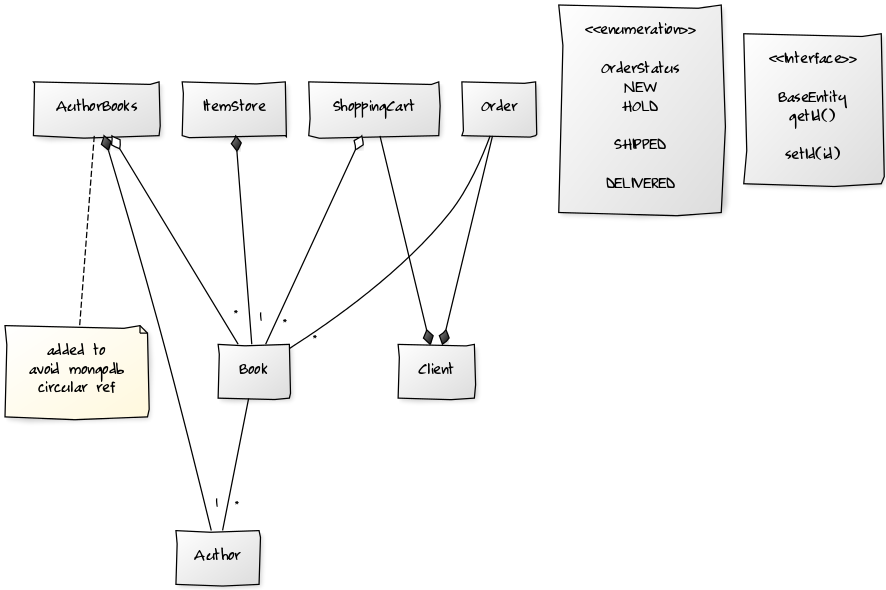

# Bookstore
Bookstore app powered by Reactive Spring, MongoDb using restful api.

# UML
## Class Diagram
Ref: [uml-diagrams.org](https://www.uml-diagrams.org/examples/online-shopping-domain-uml-diagram-example.html)  

<!--

-->

# References
## UML
diagrams where made with help of `yuml` command line. [https://yuml.me](https://yuml.me) 